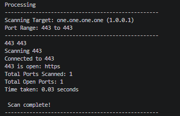

# Python Port Scanner

A multithreaded TCP port scanner written in Python that scans a user-specified range of ports, identifies open ports, and detects common services. This project was built as part of my cybersecurity learning journey to gain hands-on experience with networking, sockets, multithreading, and command-line tools.

---

## Features

- Scan a user-defined range of TCP ports
- Multithreaded scanning for faster performance
- Resolve hostnames to IP addresses
- Detect common services using `socket.getservbyport()`
- Command-line interface using `sys.argv`
- Input validation for:
  - Missing or extra arguments
  - Non-integer port numbers
  - Invalid port ranges
  - Port numbers outside 1–65535
- Displays:
  - Open ports
  - Detected services
  - Total ports scanned
  - Number of open ports
  - Total scan time

---

## Technologies Used

- Python 3
- socket
- threading
- sys
- time

---

## Installation

Clone the repository:

```bash
git clone https://github.com/Sam-Paul1/python-port-scanner.git
cd python-port-scanner
```

No external libraries are required. The project uses only Python's standard library.

---

## Usage

```bash
python port_scanner.py <target> <start_port> <end_port>
```

Example:

```bash
python port_scanner.py google.com 20 100
```

---

## Sample Output

```text
--------------------------------------------------
Scanning Target: google.com (142.250.xxx.xxx)
Port Range: 20 to 100
--------------------------------------------------

80 is open: http

Total Ports Scanned: 81
Total Open Ports: 1
Time taken: 0.24 seconds

Scan complete!
--------------------------------------------------
```

---
## Screenshot


## Project Structure

```
python-port-scanner/
│
├── port_scanner.py
└── README.md
```

---

## What I Learned

Building this project helped me understand:

- TCP socket programming
- DNS hostname resolution
- Multithreading in Python
- Command-line argument parsing
- Exception handling
- Writing modular Python code
- Network port scanning fundamentals

---

## Future Improvements

- Banner grabbing
- Thread pool implementation using `ThreadPoolExecutor`
- Save scan results to CSV or TXT
- UDP port scanning
- Service version detection
- OS detection
- Progress indicator during scanning

---

## Disclaimer

This tool is intended for educational purposes and for scanning systems that you own or have explicit permission to test. Unauthorized scanning of networks or systems may violate laws or organizational policies.

---

## Author

**Sam Abraham Paul**

Computer Science student with a strong interest in Cybersecurity, Networking, and Ethical Hacking.

GitHub: https://github.com/Sam-Paul1